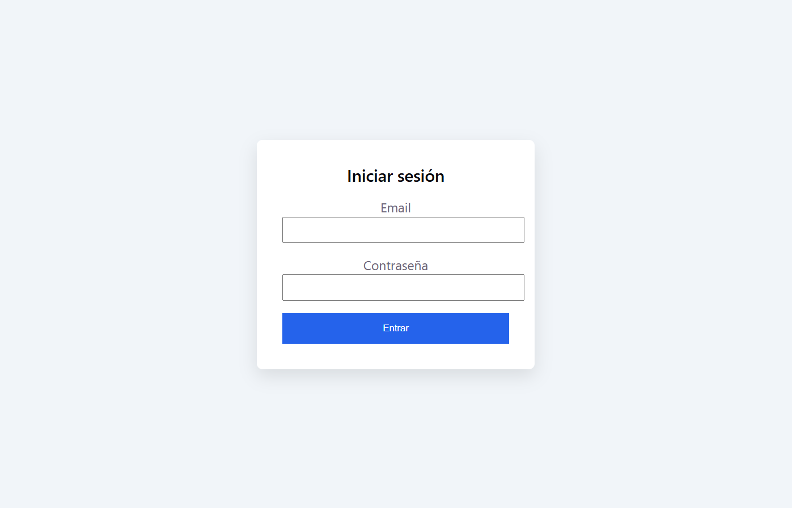
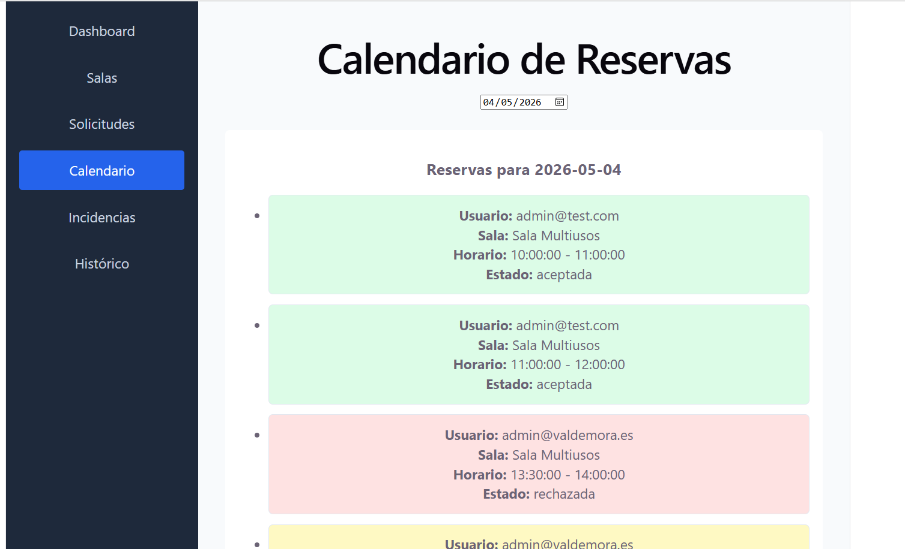
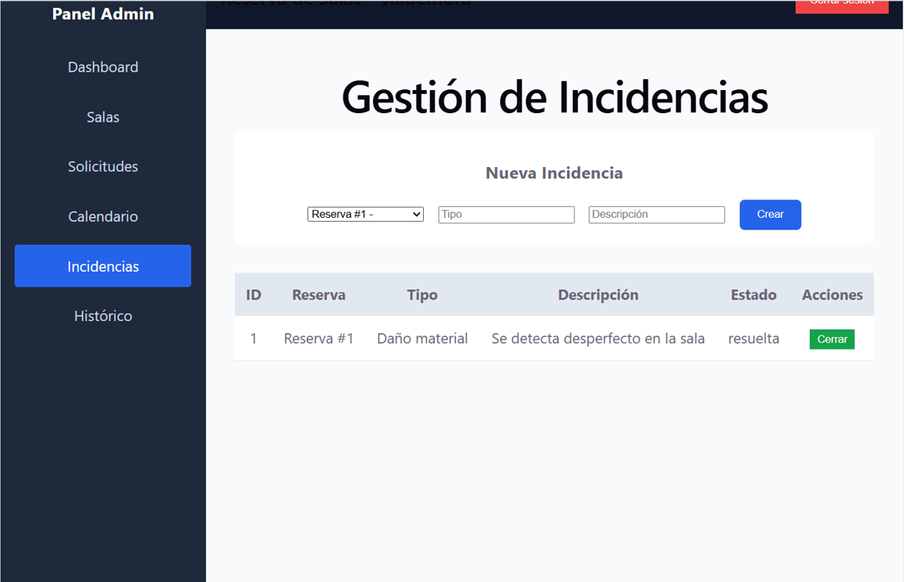

# 📦 Sistema de Gestión y Reserva de Salas – Valdemora 🚀

### Plataforma Integral para la Administración de Reservas, Solicitudes e Incidencias

---

## 📝 Documentos base del proyecto

### 📋 Análisis de requisitos

- [Análisis funcional y de requisitos](./documentos/An%C3%A1lisis%20funcional%20y%20de%20requisitos.docx)

### 👤 Historias de usuario

- [Historias de Usuario](./documentos/Historias%20de%20Usuario.docx)

### 🛠️ Diseño técnico y propuesta tecnológica

- [Diseño técnico y propuesta tecnológica](./documentos/Dise%C3%B1o%20t%C3%A9cnico%20y%20propuesta%20tecnol%C3%B3gica.docx)
### 🗓️ Plan de pruebas

- 🗓️ [Plan de Pruebas](./documentos/Plan_de_Pruebas_Reserva_Salas.pdf)
  
###  🔐 Extensiones opcionales

- 🔐 [Extensiones opcionales: Seguridad, Calidad y Deuda Técnica](./documentos/Extensiones_opcionales_Seguridad_Calidad_Deuda_Tecnica.md)

# 🖼️ Capturas de Pantalla del Sistema

---

# 1️⃣ Login

### 🔐 Autenticación de usuario

__Descripción:__\
Pantalla de acceso al sistema donde los usuarios introducen sus credenciales para autenticarse. El acceso está protegido mediante control de roles y validación de sesión.



---

# 2️⃣ Dashboard

### 📊 Panel principal de control

__Descripción:__\
Vista general del sistema donde se muestran indicadores clave como reservas activas, solicitudes pendientes, incidencias abiertas y estado general de ocupación.


---

# 3️⃣ Gestión de Salas

### 🏢 Listado de salas registradas

__Descripción:__\
Visualización completa de las salas disponibles en el sistema, mostrando información relevante como centro asociado, capacidad y estado.


---

### ✏️ Edición de salas

__Descripción:__\
Formulario para modificar la información de una sala existente, permitiendo actualizar datos como capacidad, centro o características específicas.

.png)

---

# 4️⃣ Gestión de Solicitudes

### 📄 Listado general de solicitudes

__Descripción:__\
Pantalla donde se muestran todas las solicitudes registradas, permitiendo su revisión, aprobación o rechazo por parte del administrador.


---

### 📅 Filtro avanzado por fecha

__Descripción:__\
Es posible filtrar las solicitudes por fecha utilizando diferentes modalidades:

- Antes de una fecha
- Después de una fecha
- Fecha exacta
- Entre un rango de fechas

Esto permite una gestión más precisa y eficiente.

.png)

---

# 5️⃣ Calendario

### 🗓️ Vista calendario de reservas

__Descripción:__\
Representación visual de las reservas en formato calendario, facilitando la visualización de disponibilidad y ocupación por día.



---

# 6️⃣ Incidencias

### ⚠️ Gestión de incidencias

__Descripción:__\
Módulo para registrar, consultar y gestionar incidencias asociadas a salas o reservas, permitiendo su seguimiento y resolución.



---

# 7️⃣ Histórico

### 📚 Registro histórico de acciones

__Descripción:__\
Sección donde se almacenan todas las acciones relevantes del sistema, permitiendo trazabilidad y control de auditoría.


```markdown

```

