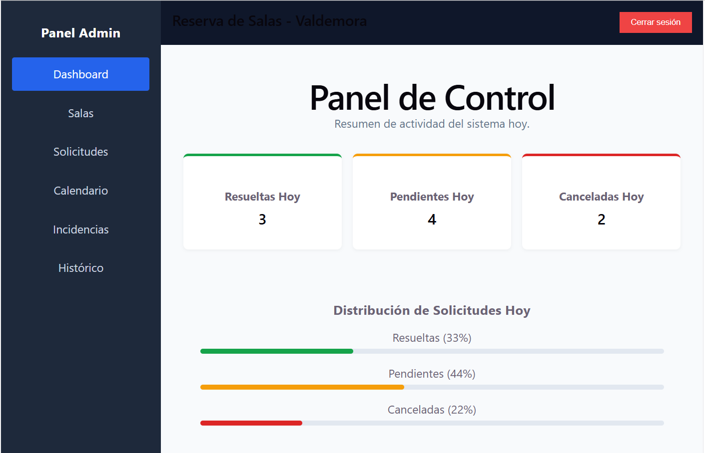

# 📦 Sistema de Gestión y Reserva de Salas – Valdemora 🚀

### Plataforma Integral para la Administración de Reservas, Solicitudes e Incidencias

---

## 📝 Documentos base del proyecto

### 📋 Análisis de requisitos

- [Análisis funcional y de requisitos](./documentos/An%C3%A1lisis%20funcional%20y%20de%20requisitos.docx)

### 👤 Historias de usuario

- [Historias de Usuario](./documentos/Historias%20de%20Usuario.docx)

### 🛠️ Diseño técnico y propuesta tecnológica

- [Diseño técnico y propuesta tecnológica](./documentos/Dise%C3%B1o%20t%C3%A9cnico%20y%20propuesta%20tecnol%C3%B3gica.docx)
### 🗓️ Plan de pruebas

- 🗓️ [Plan de Pruebas](./documentos/Plan_de_Pruebas_Reserva_Salas.pdf)
  
###  🔐 Extensiones opcionales

- 🔐 [Extensiones opcionales: Seguridad, Calidad y Deuda Técnica](./documentos/Extensiones_opcionales_Seguridad_Calidad_Deuda_Tecnica.md)

# 🖼️ Capturas de Pantalla Principales

---

## 🏢 Grupo de Capturas: Gestión de Salas

### 🔎 Vista general de salas disponibles

__Descripción:__\
Visualización completa del listado de salas registradas en el sistema, mostrando información clave como capacidad, centro asociado y estado de disponibilidad.

__Captura:__

```markdown

```

---

### ➕ Creación y edición de sala

__Descripción:__\
Formulario para registrar nuevas salas o modificar las existentes, permitiendo actualizar capacidad, centro y características técnicas.

__Captura:__

```markdown

```

---

## 📄 Grupo de Capturas: Gestión de Solicitudes

### 📅 Filtro por fecha en solicitudes

__Descripción:__\
Es posible filtrar las solicitudes por fecha utilizando cuatro modalidades:

- Antes de una fecha
- Después de una fecha
- Fecha exacta
- Entre un rango de fechas

Esto permite un control más preciso y eficiente de la gestión administrativa.

__Captura:__

```markdown

```

---

### ✅ Aprobación y rechazo de solicitudes

__Descripción:__\
Panel de administración que permite aprobar o rechazar solicitudes pendientes, generando automáticamente la reserva correspondiente o registrando el rechazo en el histórico.

__Captura:__

```markdown

```

---

## 📊 Grupo de Capturas: Dashboard y Control General

### 📈 Panel principal (Dashboard)

__Descripción:__\
Vista centralizada con métricas clave del sistema: reservas activas, solicitudes pendientes, incidencias abiertas y estado general de ocupación.

__Captura:__

```markdown

```

---

## ⚠️ Grupo de Capturas: Gestión de Incidencias

### 🛠️ Registro de incidencias

__Descripción:__\
Formulario para reportar incidencias asociadas a una sala o reserva, permitiendo su seguimiento y resolución.

__Captura:__

```markdown

```

